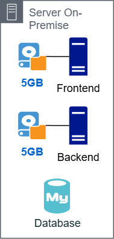
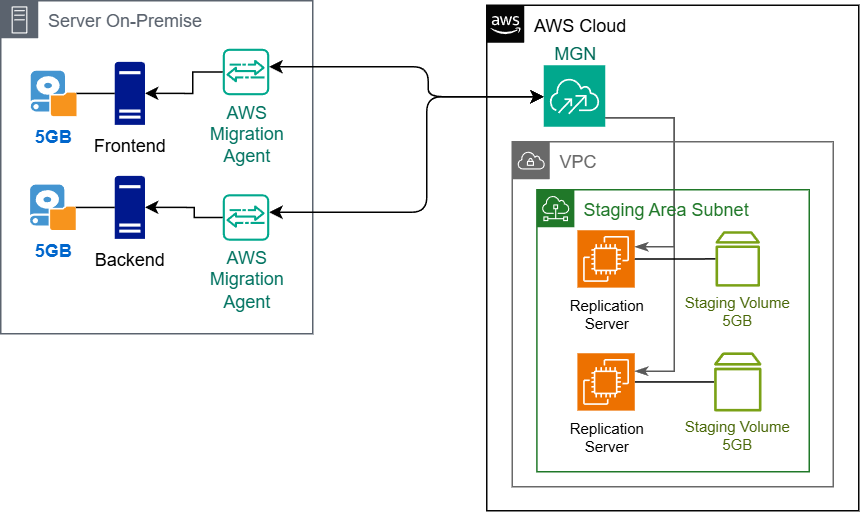
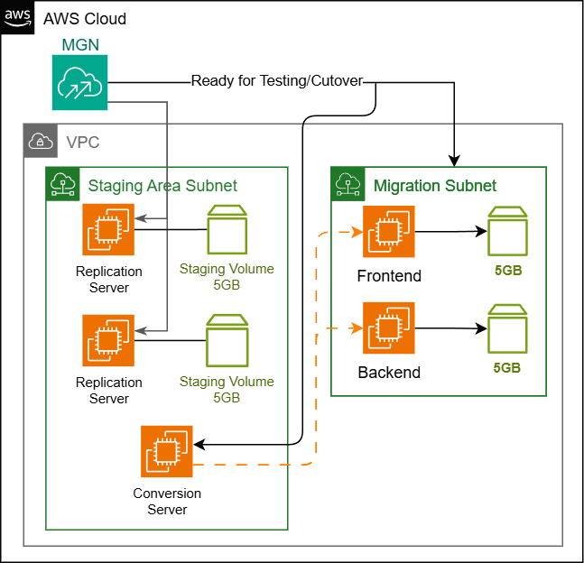
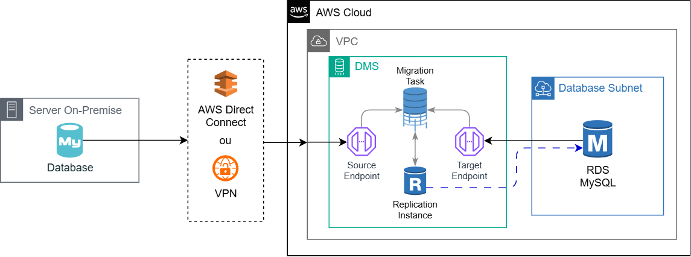
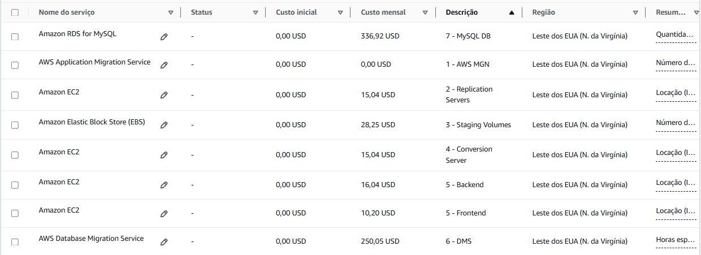
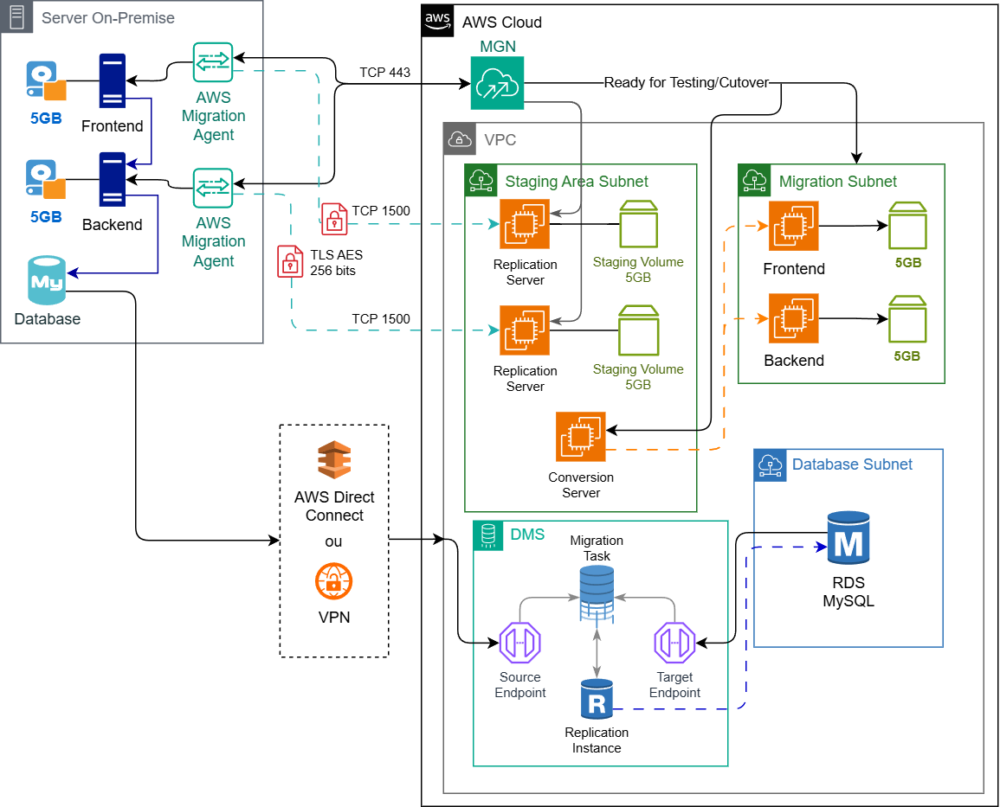

# Projeto Arquitetura de Migração de um Sistema On-Premise

Este projeto foi organizado pela Compass UOL com objetivo de estruturar um diagrama sobre o processo de migração de um servidor On-Premise para a nuvem AWS.

# Índice

- [Detalhes da Atividade](#detalhes-da-atividade)
- [Lift and Shift / As-is](#lift-and-shift--as-is---como-vai-funcionar)
- [1 - Instalação do agente de migração](#1---instalação-do-agente-de-migração)
- [2 - Initial Sync](#2---inital-sync-sincronização-inicial)
- [3 - Instâncias de teste e substituição](#3---instâncias-de-teste-e-substituição)
- [4 - Migração do banco de dados](#4---migração-do-banco-de-dados)
- [Precificação](#precificação)
- [Referências](#referências)
- [Conclusão](#conclusão)

# Detalhes da Atividade

O contexto do projeto basicamente se passa numa empresa que busca uma solução sobre o sistema eCommerce. Este sistema não está mais atendendo o aumento da demanda de acessos e compras, sendo necessário uma migração dos servidores para a nuvem AWS, que por sua vez oferece melhores opções de capacidade e escalabilidade, além de deixar todo o sistema seguro e resiliente.

O servidor atual consiste em:
- 01 servidor Frontend (REACT)
- - 5GB de dados
- - 2GB RAM
- - 1 Core CPU
- 01 servidor Backend (3 APIs, NGINX Load Balancer, armazena estáticos)
- - 5GB de dados
- - 4GB RAM
- - 2 Core CPU
- 01 Banco de Dados (MySQL) 
- - 500GB de dados
- - 10GB RAM
- - 3 Core CPU

É nosso trabalho então fazer a **Migração** e a **Modernização** do sistema, seguindo as melhores práticas de arquitetura em nuvem.

## ⚠ IMPORTANTE!

Este trabalho será dividido em duas etapas. Essa documentação só vai abordar a etapa de **migração**. Ao final, terá um link com a segunda parte, a de modernização, pertencente à minha dupla do trabalho.

# Lift-and-shift / As-is - Como vai funcionar?

Como primeira etapa, faremos uma migração "*lift-and-shift*" ou "*as-is*":

- **As-is** é uma expressão em inglês que quer dizer "como está".
- **Lift and Shift** é uma estratégia de migração de um sistema e seus dados para a nuvem, sem grandes mudanças.

Dito isso, faremos uma migração para a nuvem, sem alterar os dados existentes. Antes de fazermos essa migração, primeiro precisamos preparar o ambiente e garantir que o servidor local possa se conectar devidamente com a nuvem AWS. Com o ambiente pronto, partiremos para a fase de testes, onde as instâncias, iguais aos [servidores citados antes](#detalhes-da-atividade), serão criadas, junto de seus volumes.

# 1 - Instalação do agente de migração

Pra começar, precisamos instalar um agente de migração, o *AWS Migration Agent*, em cada máquina do servidor. Ele se conectará com a API do serviço *AWS Application Migration Service* (*AWS MGN*) e vai utilizar uma sub-rede (especificada no console, na página do serviço) para criar os recursos de preparação. 

Com a instalação do agente nas máquinas, ele vai procurar pelos volumes existentes, enquanto os recursos para fazer a replicação serão criados. Os recursos consistem em:

- **Replication Server**: Instância EC2 (**t3.small** por padrão) para cada servidor;
- **Staging Volumes**: Volumes EBS de baixo custo, com o mesmo tamanho dos volumes de origem;

# 2 - *Inital Sync* (Sincronização Inicial)

Essa sincronização é iniciada após a instalação do agente e a criação dos recursos na sub-rede de preparação. Os dados são enviados diretamente dos servidores de origem para os servidores de replicação, criptografados e comprimidos em trânsito usando TLS AES-256 bits. Estes também serão replicados de forma contínua. Essa etapa também realiza uma série de tarefas, como:

- Criação de regras de firewall
- Inicialização do servidor de replicação
- Autenticação do AWS MGN
- Download de software de replicação
- Criação de volumes de preparação
- Estabilização de comunicação entre o agente e o servidor de replicação

# 3 - Instâncias de teste e substituição

Após a sincronização incial, o status do servidor será atualizado para *Ready for Testing* (Pronto para teste). Executando a instância de teste, o *AWS MGN* criará mais uma instância EC2 (**t3.medium** como padrão) chamada de *Conversion Server* (Servidor de Conversão). É ele que fará processos como alteração de licenças de drivers, rede e sistema operacional, para que o servidor seja executado de forma nativa na AWS.
 
**Observação**: O servidor Frontend possui 2GB RAM e 1 Core CPU, enquanto o Backend possui 4GB RAM e 2 Core CPU.
Os tipos de instâncias finais serão de **t3.small** e **t3.medium** respectivamente. Esses tipos correspondem com o desempenho que já tinha localmente.

Caso nenhum erro ocorra,  a instância de teste terá seu status de execução definido como *Succeeded* (Bem-sucedido). Logo, o teste pode ser encerrado e começar a etapa de substituição (*cutover*). Novamente, caso nenhum erro ocorra, a migração foi feita com sucesso.

Quando finalizar a substituição (*Finalize Cutover*), **todos os recursos usados para a migração serão apagados**, para que não haja mais custos.

# 4 - Migração do banco de dados

Como o servidor local possui um servidor MySQL, sua abordagem de migração será diferente. Usaremos o serviço *AWS Database Migration Service* ou *AWS DMS* para isso. Este serviço possibilita a migração de banco de dados relacionais, não relacionais e outros tipos de datastores.

Antes de realizar a migração, você precisará de 3 itens:

- Endpoint do banco de dados local (Conecte o banco de dados na VPC usando uma VPN ou *AWS Direct Connect*)
- Endpoint da instância RDS que atuará como destino (O tipo da instância é **db.m6g.large** - 8GB RAM e 2 Core CPU)
- Instância de replicação (Pode ser criada no console, na página do DMS)

**Observações**: O tamanho da instância de replicação deve ser dimensionada de forma adequada com base no tanto de dados que será migrado e na taxa de transferência adequada.

Informe esses 3 parâmetros para o *Database Migration Task* e a replicação irá começar. A instância de replicação irá copiar os dados existentes e passá-los para o banco de dados de destino, no nosso caso, a instância RDS, vazia ate então.

# Precificação

O valor total mensal desses serviços ficou **671,54 USD**, porém essa estimativa inclui todos os serviços de migração. Acredito que não passará de 5 dias para esse processo, então os Replication Servers, o Conversion Server e os Staging Volumes serão deletados logo após.

*(calculadora não deixou colocar na ordem 😅)*

# Referências

+ https://docs.aws.amazon.com/pt_br/mgn/latest/ug/mgn-connector-architecture.html
+ https://docs.aws.amazon.com/mgn/latest/ug/replication-server-settings.html
+ https://explore.skillbuilder.aws/learn/course/external/view/elearning/10343/aws-application-migration-service-aws-mgn-a-technical-introduction-portuguese
+ https://www.youtube.com/watch?v=1KG4wHbnjqc

# Conclusão

Aqui se encontra o diagrama final, contendo todas as partes unidas.

A etapa do MGN se mostra mais complexa, pois envolve a replicação de toda a infraestrutura da máquina, incluindo o sistema operacional, aplicativos, dados e configurações. O serviço também precisa garantir que a instância replicada na AWS funcione em um ambiente diferente. O DMS, por outro lado, é otimizada para lidar apenas com os bancos de dados, tornando a migração relativamente rápida.